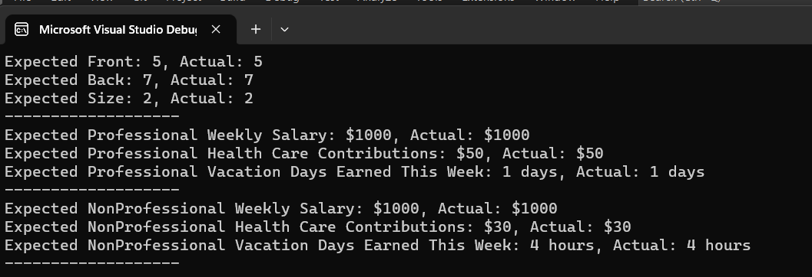

# Assignment 2

## How to Run the Code

1. Download the `Assignment2.cpp` and `Assignment2.h` files from this repository.
2. Place `Assignment2.cpp` and `Assignment2.h` in the same directory.
3. Open the files-
4. Compile and execute the program.

## Screenshots

 
